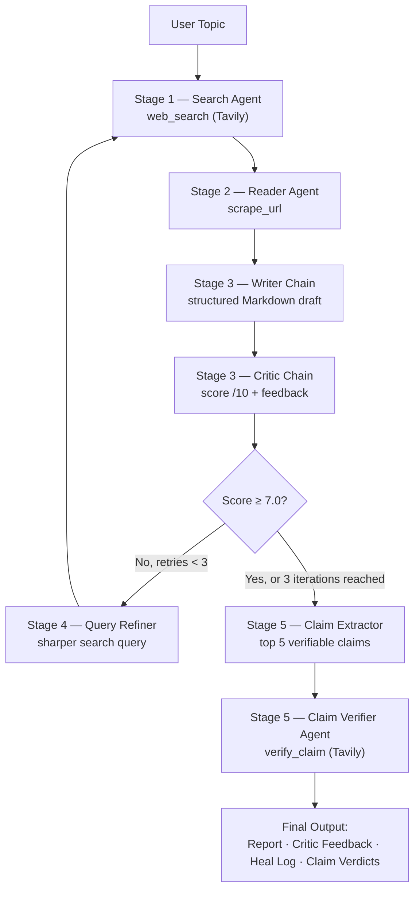

<div align="center">

# 🧠 ResearchMind

**A self-healing, multi-agent research pipeline that searches, writes, critiques, retries, and fact-checks — autonomously.**

[](https://www.python.org/)
[](https://www.langchain.com/)
[](https://langchain-ai.github.io/langgraph/)
[](https://streamlit.io/)
[](#license)
[](#contributing)

</div>

---

## Overview

**ResearchMind** takes a single topic and turns it into a verified, structured research report — with no manual intervention. Under the hood, five specialized agents and chains hand work off to one another in a closed loop: a search agent finds sources, a reader agent extracts content, a writer drafts the report, a critic scores it, and — if the score falls short — the pipeline automatically refines its search and tries again. Once the report clears the quality bar, a final verification stage cross-checks every major claim against fresh evidence.

> The result is a pipeline that doesn't just generate a report — it grades and improves its own work before handing it to you.

## Table of Contents

- [Features](#features)
- [Architecture](#architecture)
- [Project Structure](#project-structure)
- [Getting Started](#getting-started)
- [Usage](#usage)
- [Configuration](#configuration)
- [Design Decisions](#design-decisions)
- [Limitations](#limitations)
- [Roadmap](#roadmap)
- [Contributing](#contributing)
- [License](#license)

---

## Features

| | |
|---|---|
| 🔍 **Autonomous Search** | ReAct agent queries the web via Tavily and ranks results by relevance |
| 📄 **Clean Extraction** | Strips navigation, scripts, and boilerplate from scraped pages |
| ✍️ **Structured Drafting** | Generates Markdown reports with consistent Introduction / Findings / Conclusion / Sources sections |
| 🧪 **Self-Critique** | A dedicated critic chain scores every draft out of 10 with actionable feedback |
| 🔁 **Self-Healing Loop** | Automatically refines the search query and retries (up to 3×) when quality falls short |
| ✅ **Claim Verification** | Independently fact-checks the 5 most significant claims with VERIFIED / UNVERIFIED / CONTRADICTED verdicts |
| 🖥️ **Dual Interface** | Use the Streamlit UI for interactive runs or the Rich-powered CLI for terminal workflows |

---

## Architecture



| Stage | Component | Tooling | Responsibility |
|---|---|---|---|
| 1 | Search Agent | `web_search` (Tavily) | Returns titles, URLs, and snippets for the top 5 results |
| 2 | Reader Agent | `scrape_url` | Fetches the most relevant page, strips boilerplate, returns up to 3,000 clean characters |
| 3 | Writer / Critic | `writer_chain`, `critic_chain` | Drafts the report, then scores it with strengths, gaps, and a verdict |
| 4 | Self-Heal Loop | `query_refiner_chain` | Sharpens the search query against critic feedback and re-runs Stages 1–3 |
| 5 | Claim Verifier | `claim_extractor_chain`, `verify_claim` | Extracts and independently fact-checks the report's key claims |

---

## Project Structure

```
researchmind/
├── agents.py          # LLM agents: writer, critic, claim extractor, query refiner
├── app.py              # Streamlit UI
├── pipeline.py          # CLI entry point with Rich terminal output
├── tools.py             # LangChain tools + parse_critic_score utility
├── requirements.txt     # Python dependencies
└── .env                  # API keys (not committed)
```

---

## Getting Started

### Prerequisites

- Python **3.10+**
- A **Mistral API key**
- A **Tavily API key**

### Installation

```bash
git clone https://github.com/your-username/researchmind.git
cd researchmind

python -m venv .venv
source .venv/bin/activate        # Windows: .venv\Scripts\activate

pip install -r requirements.txt
```

### Environment Setup

Create a `.env` file in the project root:

```env
MISTRAL_API_KEY=your_mistral_key_here
TAVILY_API_KEY=your_tavily_key_here
```

---

## Usage

**Interactive UI**

```bash
streamlit run app.py
```

**Command line**

```bash
python pipeline.py
```

Both entry points produce the same four artifacts: the final research report, critic feedback, a log of any self-healing iterations, and a per-claim verdict table.

### Dependencies

<details>
<summary>View full <code>requirements.txt</code></summary>

```
langchain>=0.2.0
langchain-core>=0.2.0
langchain-community>=0.2.0
langchain-mistralai>=0.1.0
langgraph>=0.1.0
tavily-python>=0.3.0
beautifulsoup4>=4.12.0
requests>=2.31.0
python-dotenv>=1.0.0
rich>=13.7.0
streamlit>=1.28.0
pydantic>=2.5.0
```

</details>

---

## Configuration

These constants in `pipeline.py` and `app.py` control pipeline behavior:

| Constant | Default | Description |
|---|---|---|
| `MIN_SCORE` | `7.0` | Critic score required to skip self-healing |
| `MAX_ITERATIONS` | `3` | Maximum self-healing retries |
| `MAX_CLAIMS` | `5` | Number of claims sent to the verifier |

---

## Design Decisions

**Why merge research across iterations rather than replace it?**
Each healing iteration appends new search results to the existing context instead of starting over. This gives the writer cumulative evidence across multiple search angles, producing more comprehensive reports than a single retry would.

**Why a separate claim extractor chain instead of prompting the writer?**
Separating extraction from writing keeps each component focused on one task. The writer optimizes for prose quality; the extractor optimizes for identifying specific, falsifiable claims. Combining both into one prompt degrades both outputs.

**Why ReAct agents for search and verification, but plain chains for writing and critiquing?**
Writing and critiquing are pure text-transformation tasks suited to a single, focused prompt. Tool-calling adds latency and unpredictability with no benefit when external information isn't required — so agents use tools only where external data is genuinely needed.

**Why cap at 3 healing iterations?**
Beyond 3 iterations, the marginal quality gain from additional searches is typically small relative to the added latency and API cost. The cap also prevents runaway loops on topics where the critic is structurally hard to satisfy.

---

## Limitations

- Scraping is blocked on pages that require JavaScript rendering or authentication.
- Claim verification depends on Tavily search quality — obscure or very recent claims may return insufficient evidence and default to `UNVERIFIED`.
- The self-healing loop adds latency proportional to iteration count: a topic requiring all 3 iterations takes roughly 3× as long as one that passes on the first attempt.
- `mistral-small-2506` is used for all chains and agents. Larger models will produce higher-quality reports and more accurate claim verdicts at higher cost.

---

## Roadmap

- [ ] Pluggable search providers beyond Tavily
- [ ] Configurable model selection per stage
- [ ] Exportable PDF / DOCX report output
- [ ] Parallelized claim verification

---

## Contributing

Contributions are welcome. Please open an issue to discuss significant changes before submitting a pull request.

## License

Released under the [MIT License](#license).
